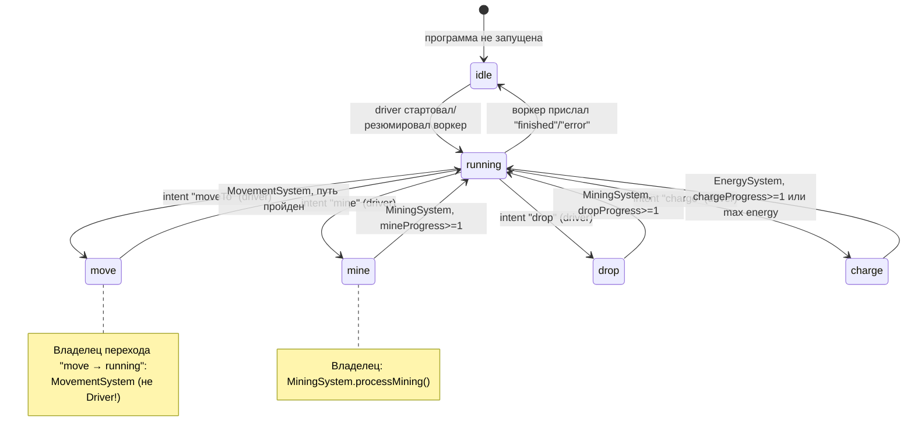
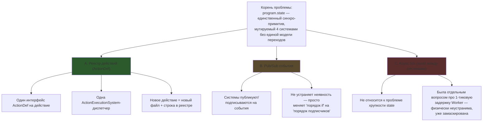
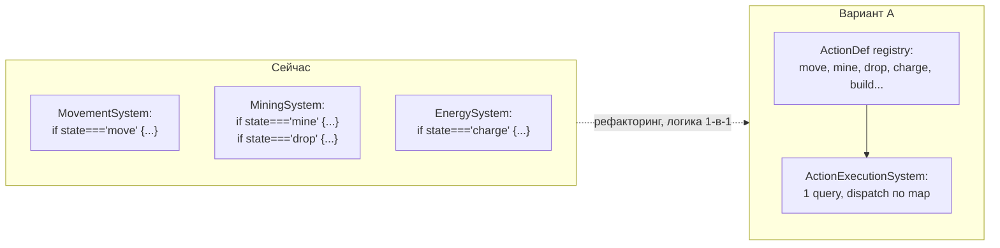

# Архитектура исполнения программ дронов: разбор и варианты рефакторинга

**Дата:** 2026-07-01
**Тип:** аналитическая сессия (диаграмма + обсуждение), без реализации
**Статус:** обсуждение завершено, вариант A выбран как направление; реализация не начата

## Зачем этот документ

Разобраться, как связаны исполнение кода дрона (async, Web Worker), синхронные ECS-системы,
`ProgramState`, Step Mode, и оценить варианты снижения хрупкости текущей модели состояния.
Отдельно разобран вопрос о задержке в 1 тик между действиями дрона.

---

## 1. Текущий поток: от Play до бесконечного цикла исполнения

```mermaid
sequenceDiagram
    participant UI as SimControls (React)
    participant GC as GameController
    participant Loop as GameLoop (setInterval 100ms)
    participant Store as gameStore.tick()
    participant Sys as 7 систем (Collision→...→Statistics)
    participant Driver as CodeBehaviorDriver
    participant Worker as Web Worker (код дрона)

    UI->>GC: onPlay() → start()
    GC->>Loop: loop.start(onTick)
    GC->>Store: setRunning(true), gameStatus="running"

    loop каждые 100мс
        Loop->>GC: onTick()
        GC->>Store: tick()
        Store->>Sys: Collision.update()
        Store->>Sys: Modifiers.update()
        Store->>Sys: ProgramExecutionSystem.update()
        Sys->>Driver: driver.step(droneId, ctx)
        alt нет сессии
            Driver->>Worker: postMessage(start, code, world)
        else session.pending есть intent
            Driver->>Driver: program.state = "move"/"mine"/...
            Driver->>Driver: phase = "action-pending"
        else phase=action-pending, state==="running"
            Driver->>Worker: postMessage(resume, world)
            Driver->>GC: gameEvents.emit("drone:actionResumed")
        end
        Store->>Sys: Movement/Mining/Energy.update()
        Note over Sys: system, чьё имя совпадает с<br/>program.state, продвигает progress;<br/>на завершении сбрасывает state="running"
        Store->>Sys: Statistics.update()
        Store->>UI: snapshotDrones() → React re-render
    end

    Worker-->>Driver: (асинхронно, в своём потоке)<br/>await self.mine() → postMessage(intent)
```

**Ключевое наблюдение:** между тем как воркер прислал intent, и тем как код дрона продолжится
после `await`, проходит минимум 2 game tick'а (200мс) — это неотъемлемое свойство границы
Web Worker (`postMessage` — межпотоковая асинхронная очередь), а не архитектурный дефект.

---

## 2. Модель состояния сейчас: `program.state` как неявная state machine



**Проблема:** переходы `X → running` физически прописаны в 3 разных системах
(MovementSystem, MiningSystem дважды — mine и drop, EnergySystem), а переходы
`running → X` — в CodeBehaviorDriver. Нет одного файла, который описывает
жизненный цикл конкретного действия целиком. Каждая система обязана знать
неписаное правило "если `program.state` равен моему имени действия — я
владею дроном в этом тике".

### Файлы и роли (для справки)

| Файл | Роль |
|---|---|
| `src/game/simulation/systems/ProgramExecutionSystem.ts` | Вызывает `CodeBehaviorDriver.step()` на каждом дроне со `state === "running"` |
| `src/game/code/CodeBehaviorDriver.ts` | Медиатор: сессия на дрона, фазы `idle/action-pending/waiting/done`, шлёт `start`/`resume` в воркер |
| `src/game/simulation/components/Program.ts` | `ProgramState` enum + `ProgramComponent` (state, mineProgress?, chargeProgress?, dropProgress?, codeStack, currentLine) |
| `src/game/simulation/systems/MovementSystem.ts` | Двигает дрона, сбрасывает `state: "move" → "running"` по завершении пути |
| `src/game/simulation/systems/MiningSystem.ts` | Прогресс mine/drop, сбрасывает `state → "running"` |
| `src/game/simulation/systems/EnergySystem.ts` | Активная/пассивная зарядка, сбрасывает `state: "charge" → "running"` |
| `src/game/code/worker/codeRuntime.ts` | Исполняет инструментированный async-код дрона в Worker, `await self.mine()` и т.п. |
| `src/game/code/worker/instrument.ts` | AST-инструментирование: вставляет `__line()`/`__call()` для подсветки строки и Call Stack |
| `src/game/GameController.ts` | `stepDroneAction()` — Step Mode: крутит тики, пока не поймает `drone:actionResumed` для дрона |

---

## 3. Разбор вопроса: «можно ли сделать взаимодействие систем асинхронным, чтобы они ждали друг друга?»

Идея пользователя: `ProgramExecutionSystem` шлёт сигнал воркеру → вычисление в воркере
мгновенное → но результат (intent) физически приходит только на следующем game tick,
даже если считать 0мс. Из-за этого движение дрона на стыке действий выглядит рывком
(остановка ~100-200мс между, например, `moveTo` и `mine`).

### Физический вердикт

`Worker.postMessage()` — вызов через границу ОС-потока. Отправка ставит сообщение в
межпотоковую очередь; получатель обрабатывает его на **своём** следующем цикле событий.
Это относится и к `main → worker`, и к `worker → main`. Даже нулевое время вычисления
в воркере не отменяет факта, что "сообщение получено" — асинхронный колбэк, который не
может обработаться в том же синхронном проходе `tick()`, откуда ушёл предыдущий `postMessage`.

**Это не устранимо синхронизацией systems через `await`** — `await` между системами внутри
одного `tick()` эквивалентен `await Promise.resolve()` (микротаска в том же макротаске) и
никак не ускоряет доставку сообщения из другого потока. Устранить теоретически можно только
`SharedArrayBuffer` + `Atomics.wait()` (блокирующее ожидание потока) — избыточно и рискованно
для UI-потока, не тот случай.

### Уже реализованная маскировка (3 механизма)

1. **Continuous path movement** (`commit 6078efc`, `CodeBehaviorDriver.ts:158-183`) — если
   дрон уже в движении, новая цель дописывается в хвост текущего пути (`extendPathTail`)
   вместо сброса. `MovementSystem` идёт по всему буферу пути без пауз между шагами.
2. **Look-ahead snapshot** (`commit 26756af`, `worldSnapshot.ts:20-24`) — воркер получает
   `self.position` как `path[0]` (следующая клетка), а не текущую позицию. Код дрона
   планирует "от точки, куда он и так доедет", компенсируя задержку resume на уровне логики.
3. **Визуальная интерполяция** (`GameScene.ts:226-249`) — Phaser рисует на частоте монитора
   между тиками симуляции (100мс), сглаживая позицию по прошедшей доле тика.

### Что не замаскировано

Маскировка работает для **непрерывного движения**. На стыке **разных действий**
(`moveTo → mine`) задержка в 1-2 тика (100-200мс) реальна и видима — дрон физически
останавливается перед тем, как начать копать. Если это станет отдельной болью — решение
лежит в стороне *предиктивного вычисления следующего intent* (спросить воркер "что дальше"
заранее, на N-1 тике до завершения текущего действия), но это отдельная фича со своими
рисками (откат intent при изменении мира) — не предмет этой сессии.

---

## 4. Варианты решения проблемы хрупкости state



### Сравнительная таблица

| Критерий | Текущее состояние | A: Реестр действий | B: Pub/Sub | C: Async tick |
|---|---|---|---|---|
| Явность переходов | Плохо — неписаное правило живёт в 4 системах | Хорошо — весь жизненный цикл действия в одном файле | Средне — подписки разбросаны, порядок так же неявен | Не меняется — проблема не в синхронности вызова |
| Добавить "build" | Новая система + решать порядок + новое optional-поле на компоненте | 1 новый файл `ActionDef` + 1 строка в реестре, старые системы не трогаем | Новый подписчик + решить порядок относительно других | Не решает — реестр всё равно нужен |
| Здания с программами | Требует дублирования логики ProgramExecution | Тривиально — тот же `Program`-компонент на entity здания | Тривиально — подписка на те же события | Не относится |
| Производительность | 3-4 лишних query+if прохода по всем дронам за тик | Лучше — 1 query, map-dispatch вместо if-цепочки | Возможные накладные расходы на emit/dispatch | Хуже — доп. микротаски без выигрыша |
| Риск/размер правки | — | Средний — перенос логики 1-в-1 | Средний-высокий — переписать tick-flow | Высокий — риск сломать step-mode |
| Влияние на Step Mode | Работает | Не меняется — `drone:actionResumed` эмитится тем же способом | Риск — событие может прийти в непредсказуемый момент относительно тика | Риск — ломает гарантию "1 тик = 1 атомарный шаг" |

**Вывод:** вариант **A выигрывает по всем критериям** и наименее рискован — это перенос
существующей логики в другую форму (map вместо if-цепочки), а не смена модели исполнения.
Локально можно использовать pub/sub *точечно* внутри A (например, `ActionDef` эмитит
событие по завершении — паттерн уже есть: `gameEvents.emit("ore:mined")`), но не как
основу архитектуры.

---

## 5. Дизайн варианта A: реестр действий

### Сейчас vs предлагается



### Интерфейсы

```ts
// src/game/simulation/actions/ActionDef.ts
interface ActionDef {
  id: CodeAction;                            // "move" | "mine" | "drop" | "charge" | "build" | ...
  tick(ctx: ActionTickCtx): ActionResult;     // "pending" | "done"
}

// src/game/simulation/actions/registry.ts
const ACTIONS: Record<CodeAction, ActionDef> = {
  move:   moveAction,
  mine:   mineAction,
  drop:   dropAction,
  charge: chargeAction,
  build:  buildAction,   // новое действие = 1 файл + 1 строка
};

// src/game/simulation/systems/ActionExecutionSystem.ts (заменяет разбросанную логику)
update() {
  for (const droneId of world.query("Program")) {
    const program = world.getComponent(droneId, "Program");
    for (const slot of Object.keys(program.activeActions) as ActionSlot[]) {
      const active = program.activeActions[slot];
      if (!active) continue;
      const action = ACTIONS[active.kind];
      const result = action.tick({ world, droneId, data: active.data });
      if (result === "done") delete program.activeActions[slot];  // единственное место сброса
    }
  }
}
```

### Изменение `ProgramComponent`

Вместо `state: ProgramState` + `mineProgress?/chargeProgress?/dropProgress?` (россыпь
опциональных полей, по одному на действие) — карта активных действий по слотам:

```ts
type ActionSlot = "locomotion" | "tool";  // + "turret" и т.п., если появятся параллельные actuator'ы

interface ActiveAction {
  kind: CodeAction;
  progress: number;     // [0..1) — единый прогресс для любого действия
  data?: unknown;        // point для move, targetId для build, и т.п.
}

interface ProgramComponent {
  // ...
  activeActions: Partial<Record<ActionSlot, ActiveAction>>;   // {} = "running"/idle
}
```

Каждый `ActionDef` декларирует свой `slot` (`move` → `locomotion`; `mine`/`drop`/`charge`/`build` →
`tool`). Сейчас в игре у дрона фактически один actuator за раз, поэтому на старте это можно
реализовать как объект с максимум одним занятым ключом — но сам тип уже не мешает добавить второй
слот (например будущую стрельбу как `turret`) без переписывания `ProgramComponent` и протокола
intent/resume. См. §6 ниже.

### Важное уточнение: момент resume воркера НЕ меняется

Это два разных вопроса, которые легко перепутать:

1. *Кто решает, что действие завершилось* — это меняется (сейчас разбросано по
   Movement/Mining/Energy, будет — внутри `ActionDef.tick()`)
2. *Кто и когда шлёт воркеру `postMessage(resume)`* — не меняется вообще, этим
   по-прежнему занимается `CodeBehaviorDriver`, тем же кодом, тем же местом:

```ts
// CodeBehaviorDriver.ts:134-146, меняется только условие проверки
if (session.phase === "action-pending") {
  if (Object.keys(program.activeActions).length > 0) return;  // было: program.state !== "running"
  session.phase = "idle";
  session.port.postMessage({ type: "resume", world: ... });  // не меняется
  gameEvents.emit("drone:actionResumed", { droneId });        // не меняется
}
```

Порядок систем в `tick()` тоже не меняется — `ActionExecutionSystem` просто занимает
место, где сейчас последовательно исполняются куски Movement/Mining/Energy, отвечающие
за прогресс действия, сразу после `ProgramExecutionSystem`.

### Ответы на 3 исходных беспокойства

- **Явность:** весь жизненный цикл действия читается в одном файле (например
  `mineAction.ts`), а не размазан между driver и системой.
- **Расширяемость** (build, здания с программами): новое действие = новый `ActionDef` +
  запись в реестре, без правок в существующих системах. Здания с программами переиспользуют
  тот же `Program`-компонент + `ActionExecutionSystem` — не нужна отдельная инфраструктура.
- **Производительность:** нейтрально или лучше — сейчас 3 системы каждый тик делают
  холостой query+if проход по бездействующим дронам; в новой модели один проход, один
  query, dispatch по map вместо if-цепочки.

### Масштаб изменения

Рефакторинг среднего размера: новый тип `ActiveAction`, 4 файла `ActionDef` (перенос
существующей логики один-в-один, не новая логика), новая `ActionExecutionSystem` вместо
кусков в Movement/Mining/Energy, правка условия в `CodeBehaviorDriver`. Step mode не
меняется — `drone:actionResumed` остаётся тем же сигналом, тем же местом кода.

---

## 6. Дополнительные вопросы (follow-up после дизайна)

### Нужна ли внешняя state-machine библиотека (XState и т.п.)?

Нет, не рекомендуется. Такие библиотеки дают визуализацию, guards, parallel states "из коробки",
но добавляют асинхронную событийную модель поверх уже синхронной, детерминированной модели тика —
для 100мс-tick и Step Mode, где важна предсказуемость каждого перехода, это лишний непрозрачный
слой поверх и так существующего Worker-протокола. Реестр `ActionDef` — это уже достаточная
формализация: `Record<CodeAction, ActionDef>` — обычный TS discriminated-union dispatch,
тайпчекается сам по себе. Из полезного — не библиотека, а мелкий внутренний хелпер:
`defineAction()` с exhaustiveness-check (через `never`), чтобы TS не давал забыть завести
`ActionDef` для нового `CodeAction`.

### Несколько активных действий одновременно (например «ехать и стрелять»)

Гипотетический будущий кейс — стрельбы/аналога сейчас нет в GDD, вопрос был "не закрыться
архитектурно". Ответ заложен в дизайне §5 через `ActionSlot`: `move` занимает слот `locomotion`,
`mine`/`drop`/`charge`/`build` — слот `tool`. Каждый `ActionDef` декларирует свой слот,
`ActionExecutionSystem` крутит все занятые слоты одного дрона за тик независимо друг от друга,
driver считает дрона свободным для resume, когда пусты **все** слоты (для будущего частичного
resume — когда пуст только нужный слот, если API кода дрона это разрешит).

**Важно:** реализовывать параллельные слоты сейчас не нужно (в игре пока один actuator).
Единственное, что стоит сделать заранее — выбрать тип `activeActions: Partial<Record<ActionSlot, ActiveAction>>`
вместо `activeAction: ActiveAction | null` на этапе рефакторинга, чтобы не пришлось второй раз
менять форму `ProgramComponent` и протокол intent/resume, когда параллельный actuator появится.

---

## Итог сессии

Направление выбрано: **вариант A (реестр действий)**, с `activeActions` по слотам
(`ActionSlot`), чтобы не закрыться архитектурно на будущие параллельные actuator'ы
(гипотетический пример — «ехать и стрелять»). Внешняя state-machine библиотека не нужна —
реестр `ActionDef` уже достаточная формализация. Реализация не начата — эта сессия только
диаграмма и анализ, по явному запросу в начале брейнсторминга. Если и когда будет решено
реализовывать — нужен отдельный проход через `writing-plans` с конкретным планом переноса
логики из Movement/Mining/Energy в `ActionDef`-модули.
